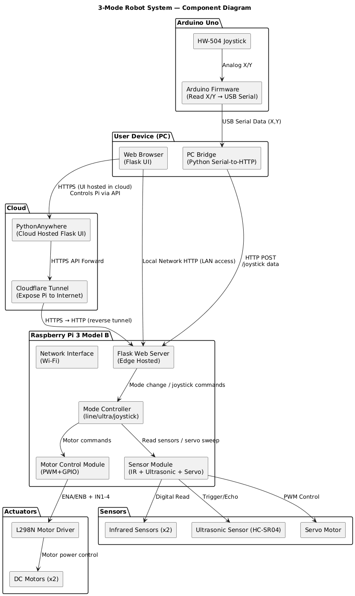

# Step 1: Hardware Assembly

### 1. Mount components on chassis
* Attach:
  * Raspberry Pi
  * L298N motor driver
  * Ultrasonic sensor + servo
  * IR sensors (left + right)
  * Motors, wheels
  * Battery pack for motors
  * Power bank for Raspberry Pi

### 2. Wiring motors to L298N
* Motor A → OUT1 & OUT2
* Motor B → OUT3 & OUT4
* Motor battery → +12V/VIN on L298N
* GND → battery negative

### 3. Wiring L298N to Raspberry Pi
* ENA → GPIO18 (PWM)
* IN1 → GPIO23
* IN2 → GPIO24
* ENB → GPIO19 (PWM)
* IN3 → GPIO27
* IN4 → GPIO22
* L298N GND → Raspberry Pi GND
* (Mandatory common ground)

### 4. Wiring IR sensors
* VCC → 5V
* GND
* OUT-left → GPIO5
* OUT-right → GPIO6

### 5. Wiring ultrasonic sensor
* TRIG → GPIO17
* ECHO → GPIO4 (through level shifter or voltage divider)
* VCC → 5V, GND

### 6. Wiring servo
* Signal → GPIO12
* VCC → 5V external (avoid powering servo directly from Pi 5V)
* GND → same ground

### 7. Test each wiring path individually
* Motors spin when commanded
* IR sensors toggle readings
* Ultrasonic distance returns reasonable values
* Servo rotates smoothly
* Pi boots from power bank

---

# Step 2: Raspberry Pi Software Setup

### 1. Install OS and packages

Install RPi OS, then:
```shell
sudo apt update
sudo apt install python3-flask python3-gpiozero python3-pip
pip install flask flask-socketio eventlet
```
### 2. Implement motor control
* PWM init
* forward(), backward(), turn_left(), turn_right(), stop()

### 3. Implement sensors
* read_IR()
* ultrasonic_distance()
* servo_sweep()

### 4. Implement control loops
* line_follow_loop()
* ultrasonic_loop()
* joystick_loop()

### 5. Add global state
```python
current_mode = "stop"
joystick_target = (0,0)
```

### 6. Build simple browser UI
Buttons:
* Line Follow
* Ultrasonic Navigate
* Joystick Remote
* Emergency Stop

# Step 3: Arduino + PC Bridge Setup

### 1. Wire joystick to Arduino
HW-504 joystick:
* VRx → A0
* VRy → A1

### 2. Write PC bridge program
Python script:
* Read USB serial
* Normalize X/Y to [-1,1]
* POST to `http://raspberrypi.local:5000/api/joystick`

---

# Step 4: Networking & Cloud Setup

### 1. Raspberry Pi local network
* Ensure Pi reachable by name or IP
* Example: `http://pi3robot:5000`

### 2. Install Cloudflare Tunnel

```shell
curl -L https://developers.cloudflare.com/cloudflare-one/connections/connect-apps/install-and-setup/installation 
cloudflared tunnel create robot
cloudflared tunnel route dns robot robot.example.com
cloudflared tunnel run robot
```
This exposes Pi Flask web UI to the internet.

### 3. Deploy UI to PythonAnywhere
* Upload same Flask app
* PythonAnywhere will provide a public URL
* This UI forwards commands to the Pi using the Cloudflare URL
* Useful for remote mode switching and telemetry

# Step 5: Mode Integration

### 1. Integrate mode switching

In `controller.py`:
```python
if mode == "line":
    line_follow_loop()
elif mode == "ultra":
    ultrasonic_loop()
elif mode == "joystick":
    joystick_loop()
```

### 2. Implement safety

* Stop motors when mode changes
* Add emergency stop route `/api/stop`

# Step 6: Full Robot Testing

### 1. Test individually
* Motor test
* IR sensors
* Ultrasonic + servo sweep
* Arduino reading
* PC bridge → Pi API
* Flask UI → motor control

### 2. Test full modes
#### Mode A: Line follow
* Place on track with black line and white background
* Adjust thresholds

#### Mode B: Ultrasonic navigate
* Place obstacles
* Ensure longest path chosen correctly

#### Mode C: Joystick remote
* Move robot around room
* Check responsiveness

# Step 7: Optimization & Finalization

### 1. Add battery monitoring 
* ADC module
* Battery warnings

### 2. Add logging
* Sensor values
* Mode changes

### 3. Improve UI
* Real-time graphs
* Camera feed (*optional*)

---

# Component Diagram



---

# Sequence Diagram


